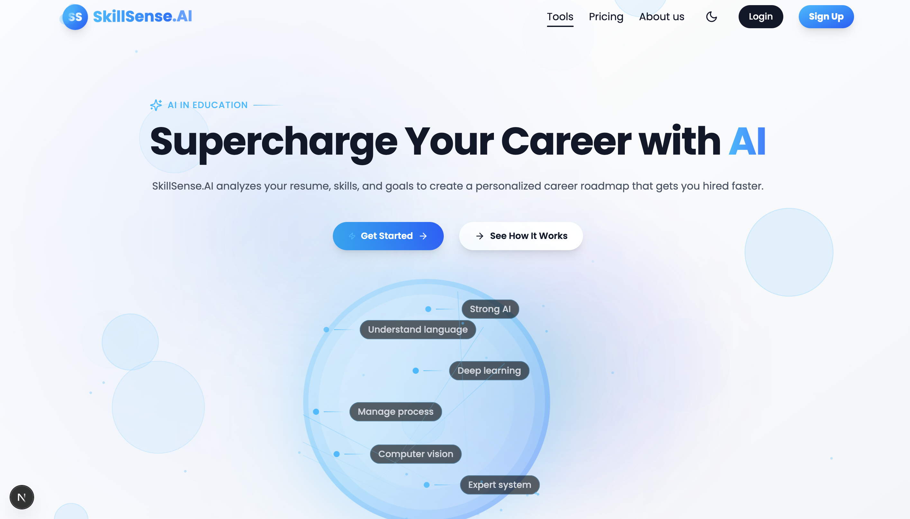
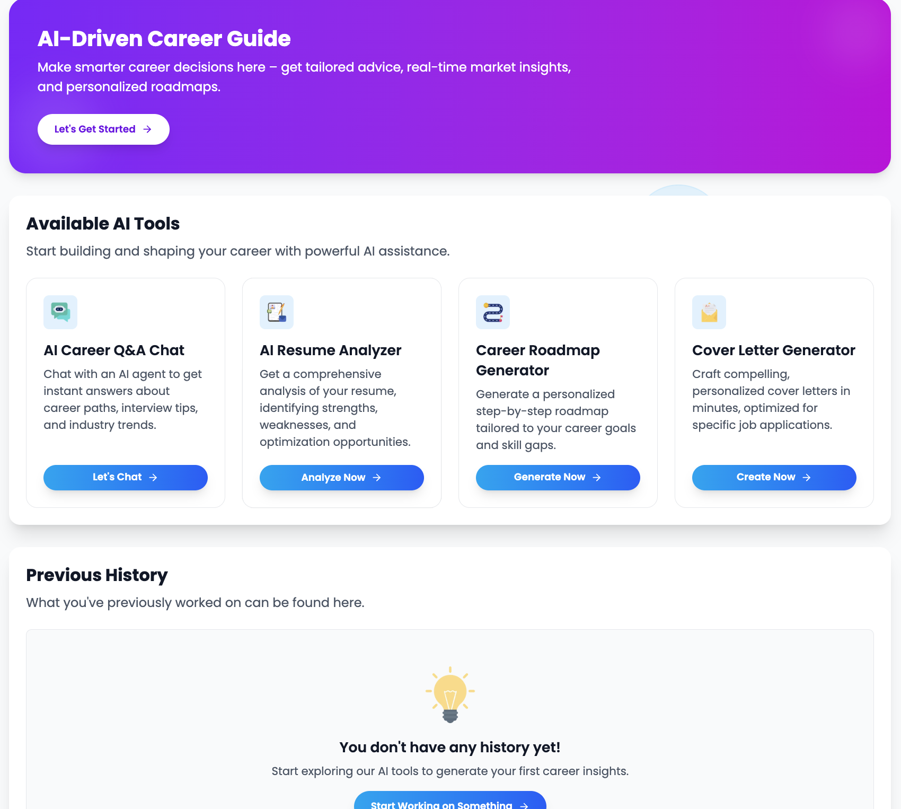
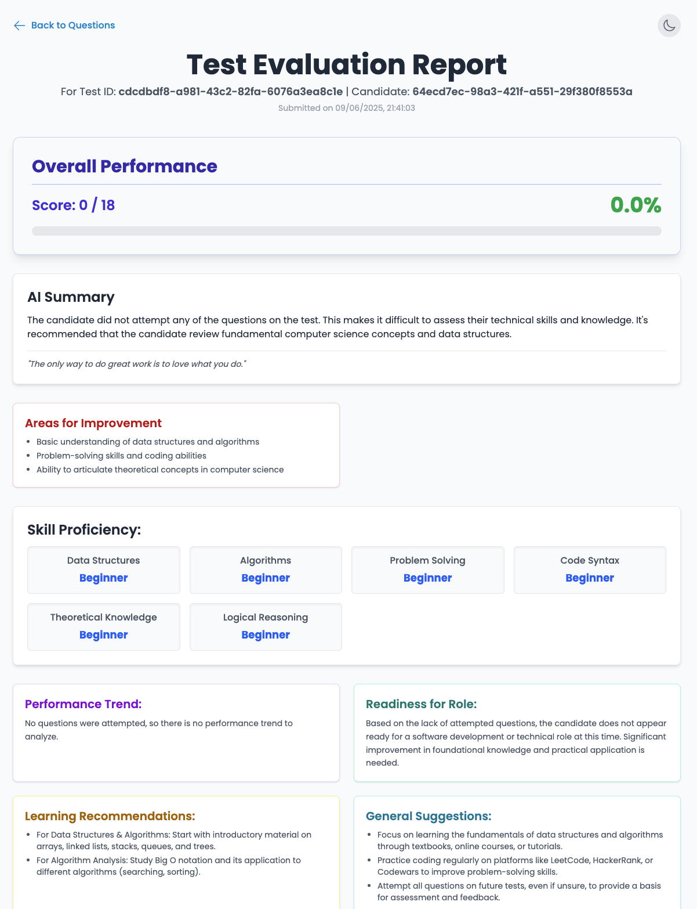

# 🚀 SkillSense.AI – Your AI Career Companion

[](https://skillsense-ai-iota.vercel.app/)
[](LICENSE)

**SkillSense.AI** is an AI-powered career and skill evaluation platform that helps users understand their strengths, receive intelligent feedback, and navigate personalized upskilling paths. Built with **Next.js**, **TypeScript**, **Tailwind CSS**, and powered by **Gemini AI**, it combines tech, psychology, and design to supercharge your career journey.

---

## 📸 Demo

Explore the live platform: [https://skillsense-ai-iota.vercel.app/](https://skillsense-ai-iota.vercel.app/)

<p align="center">
  
  
  
</p>

---

## ✨ Features

- 🎯 **AI Skill Evaluation** – Role-based adaptive assessments
- 📈 **Goal Tracker** – Daily personalized learning goals with streaks & badges
- 🎤 **Voice Input & Output** – Answer via speech, receive AI audio feedback
- 📊 **Dashboard** – Track goals, skill growth & performance summaries
- 📄 **Resume Analyzer** – Upload and receive ATS-ready feedback instantly
- 🧠 **Interview Simulator** – Practice interviews and get real-time AI critique
- 🗺️ **Career Path Visualizer** – See your next steps and career projections
- 🧩 **Soft Skill Gap Analysis** – Identify communication, teamwork & other gaps
- 🧵 **Community Forum** – Connect, share, and learn (Coming Soon)
- 🕹️ **Gamification** – Earn badges, track progress, and stay motivated

---

## 🛠 Tech Stack

- **Frontend:** Next.js, React, TypeScript, Tailwind CSS
- **Backend:** Node.js (API Routes), MongoDB & PostgreSQL
- **State Management:** Redux Toolkit
- **AI Engine:** Gemini API, INNGEST
- **Authentication:** NextAuth.js (OTP + JWT)
- **Deployment:** Vercel

---

## 📁 Project Structure

Skillsense.ai/
├── public/              # Static assets and images for the demo
├── src/
│   ├── app/             # Core application routing and pages
│   │   ├──--(All pages)/      # Authentication routes (login, signup)/Dashboard
│   │   /-----(Landing page) 
│   │   └── api/         # API route handlers for all backend logic
│   ├── components/      # Reusable React components (UI, layout, etc.)
│   ├── inngest/         # Inngest functions for background jobs
│   ├── lib/             # Utility functions, DB schema, and connections
│   ├── redux/           # Redux Toolkit store, slices, and actions
│   └── types/           # TypeScript type definitions
├── .env.example         # Example environment variables
├── drizzle.config.ts    # Drizzle ORM configuration
├── next.config.mjs      # Next.js configuration
└── package.json         # Project dependencies and scripts


---

## ⚙️ Installation

1. **Clone the repo**

```bash
git clone https://github.com/Shreyanshdev/Skillsense.ai.git
cd skillsense.ai
```
Install dependencies
```bash
npm install
# or
yarn install
```
Setup environment variables

```bash

cp .env.example .env.local
Fill in values like:

GOOGLE_API_KEY

DATABASE_URL

JWT_SECRET

MONGODB_URI

NEXTAUTH_SECRET

INNGEST_SIGNING_KEY, etc.
```
Run dev server

```bash

npm run dev
Open http://localhost:3000 🚀
```
🔑 Environment Variables
env
```
GOOGLE_API_KEY=
DATABASE_URL=
JWT_SECRET=
MONGODB_URI=
NEXTAUTH_SECRET=
NEXT_PUBLIC_OPENAI_API_KEY=
NEXT_PUBLIC_BACKEND_CODE_EXECUTION_URL=
INNGEST_SIGNING_KEY=
MAIL_HOST=
MAIL_USER=
MAIL_PASS=
IMAGEKIT_PUBLIC_KEY=
IMAGEKIT_PRIVATE_KEY=
IMAGEKIT_URL_ENDPOINT=
```
💡 Usage Guide
✅ Signup / Login with OTP verification

🧠 Select Career Role to begin personalized AI-based evaluation

🎤 Answer Questions via text or voice

📊 Track Goals and maintain daily streaks

📄 Upload Resume for instant AI feedback

🧪 Practice Interviews and receive AI tips

🏅 Earn Badges & explore career roadmap

🤝 Contributing
Contributions are welcome!

```bash

git checkout -b feature/YourFeature
git commit -m "Added YourFeature"
git push origin feature/YourFeature
Then create a Pull Request ✨
Please follow coding conventions and add tests when applicable.
```

📜 License
This project is licensed under the MIT License – see the LICENSE file for details.

## Made with ❤️ by @Shreyanshdev ##


